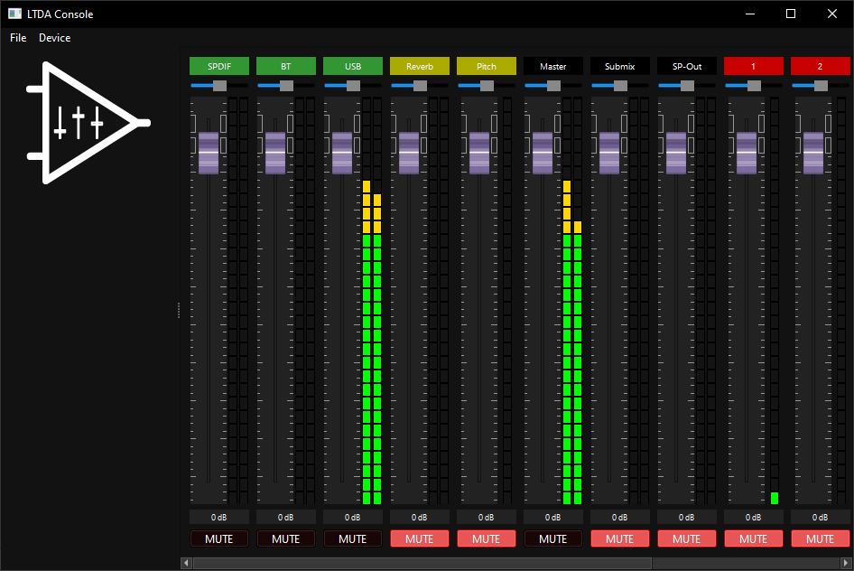

    <picture>
        <source media="(prefers-color-scheme: dark)" srcset="img/logo.svg">
        <source media="(prefers-color-scheme: light)" srcset="img/logo_inverted.svg">
        
    </picture> 

<h3 align="center"><a href="README-ru.md">Прочитать на русском</a></h3>

# LTDA Console
Remote control application for my <a href="https://github.com/lethanner/ltda-prime">LTDA Prime</a> project, written in Qt.  
Currently under development (version 0.1.3-alpha).  

**Multiple instances of the LTDA Console can be simultaneously connected to the device when it using the same LAN.**  
## Technical information
This program automatically downloads a channel list from the device using a TCP socket and JSON. The TCP socket is also used for control commands.  
Fader positions, balance sliders, mute buttons and level indicators are synchronized in real-time. Synchronization packets ('live data' in code) are received through Multicast UDP using a custom protocol.  
  
When using UART, the same JSON is used for control commands request-response, but signature bytes, protocol version, packet length etc. are appended to the beginning of every request-response packets.  
In this case, synchronization packets are sent only upon ping request to avoid collisions.
> [!WARNING]
> UART synchronization currently has a very low refresh rate. It is also extremely unstable for now and may completely fail if at least one byte is dropped until restart.